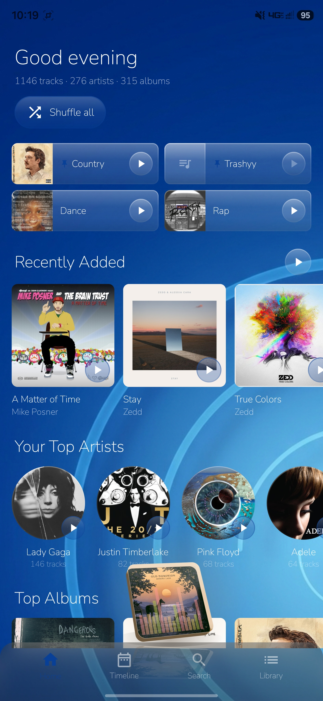
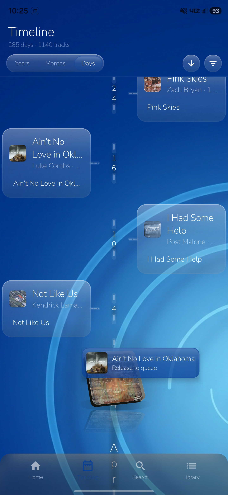

# VisiBeat

An offline Android music player that lays your library out as a **timeline** instead of a list.

Most players sort by the date you added a file. VisiBeat sorts by when the music was
*released*, so scrolling your library is scrolling through decades — a 1974 record and a
2024 single sit where they actually belong, not where your import order happened to put
them.

Everything runs on your device against your own files. There is no account, no cloud
library, and no telemetry.

[](LICENSE)
[](https://github.com/Shiz0id/visibeat/releases)


---

## Screenshots

| Home | Timeline, with drag-to-queue |
|---|---|
|  |  |

More in [`Screenshots/`](Screenshots), including `Where it began.jpg` — the same timeline
before the visual rework, kept as a before-shot.

---

## Install

Grab the APK from the [latest release](https://github.com/Shiz0id/visibeat/releases/latest)
and open it on your phone.

- **Android 7.0 (API 24)** or newer
- **64-bit ARM only** (`arm64-v8a`) — essentially every phone since ~2017. It will not
  install on x86 devices or the standard Android Studio emulator.

> **The beta APK is debug-signed.** It carries the Android debug key, which ships with
> every copy of the Android SDK. The practical consequence: when a properly signed release
> arrives, Android will refuse to upgrade over this build, and uninstalling clears the
> app's database — including your accumulated play history. Treat anything the beta builds
> up as temporary.

---

## What it does

### The timeline

The centrepiece. Your library plotted against release date, as a branching tree rather
than a list.

- **Three zoom levels** — year, month, day. Zooming moves between them and keeps the
  date you were looking at centred.
- **Branches** grow off a central spine, with album art at the leaves; density reflects
  how much music you own from that period.
- **Tap a bucket** to open a feed of everything released in it.
- **Filters** for bucket size, sort direction, and *date quality* — how the release date
  was established (see [Where dates come from](#where-dates-come-from)). Filtering to
  `USER`/`MUSICBRAINZ` hides everything resting on an unreliable file tag.
- **Undated tracks** are counted separately rather than dumped at the epoch. Files with
  no usable date do not silently become "January 1970".
- **Drag to queue** — drag any track from the timeline onto the now-playing cube to
  append it. The cube pins itself to a fixed spot on this screen so it is aimable.

### Playback

Built on Media3 / ExoPlayer with a real `MediaSessionService`, so lockscreen controls,
notification controls and headset buttons all work.

- Queue with reordering, shuffle, and repeat (off / all / one)
- Play or shuffle a track, album, artist, playlist, or the whole library
- Add to queue from anywhere; long-press any track for its detail sheet
- Seek by scrubbing, skip forward/back
- Play history recorded on track start — this is what drives "top artists", "top albums"
  and the recency shelves
- Queue survives rotation and returning to a still-playing app

### The now-playing cube

A free-floating, draggable album-art **cube** rather than a bottom bar.

- Real perspective projection with extruded side faces, tilt and roll — the geometry is
  pure math, unit-tested, and lives in [`CubeGeometry.kt`](music-ui/src/main/java/com/visibeat/musicui/playback/CubeGeometry.kt)
- **Sways to the music**, driven by a live FFT of the audio output
- Optional mirrored reflection beneath it (toggleable)
- Drag it anywhere on screen; the position persists. "Recentre the cube" in Settings
  rescues it if you park it somewhere awkward
- Tap to expand into the full player, with a spectrum visualiser coloured from your
  wallpaper

The visualiser uses Android's `Visualizer` API, which is why the app asks for
`RECORD_AUDIO`. It reads the app's own output — nothing is recorded, stored or sent.

### Radio — on-device similarity

Station generation from **audio content**, not tags or listening data. No service is
consulted; the model runs on your phone.

- A distilled CLAP model (**AudioMuse-AI DCLAP**, ~7M params, 512 dimensions) embeds each
  track from its mel spectrogram, in 10-second segments at 50% overlap, averaged and
  L2-normalised
- Stations are seeded from what you tapped, and **what you tapped changes the rules**:
  - **Track radio** — exploratory. Drifts 35% toward each new pick, penalises repeating
    the same artist or album
  - **Album radio** — stays near that record's world, but the album penalty stops it
    simply replaying the record
  - **Artist radio** — the same-artist penalty becomes a small *bonus*, since you asked
    for that artist; the album penalty spreads it across their catalogue
- Similarity floors are **measured against a real library**, not guessed. On a 1,066-track
  collection, two random tracks average 0.50 cosine, so a naive floor of 0.2 lets 94% of
  the library through — a shuffle wearing a filter. The floor sits at 0.65
- A ceiling at 0.995 catches duplicate rips the metadata merge cannot see
- Anti-repetition uses a hard 30-track exclusion window, not a penalty — a penalty large
  enough to matter still loses to a high enough similarity, which is exactly how you get
  a two-track loop
- Weighted sampling over the top candidates with a low softmax temperature, so the
  ranking survives the fact that real neighbours cluster in a narrow band

Indexing runs in a `WorkManager` job **while charging** by default, with controls in
Settings to force a run on battery, stop, retry unreadable files, or clear the index.

### Library, search and collections

- **Home** — a greeting that tracks the time of day, plus pinned items, recently added,
  your top artists, top albums, and shuffle-all
- **Library** — Liked Songs, Liked Albums, Liked Artists, Playlists, and full Album,
  Track and Artist listings
- **Search** across artists, albums and songs, with recent searches
- **Album pages** with a format badge showing what the files *actually are* — FLAC, ALAC,
  WAV, AIFF, MP3, AAC, OGG, OPUS, WMA — derived from the MIME type. A local library has
  no meaningful equivalent of a streaming tier, so it reports the container instead
- **Artist pages** with portrait, Wikipedia lead section, release carousels grouped by
  type, top tracks, and a per-artist album timeline
- **Playlists** with create, rename, delete, add-to-playlist from any track, and a sort
  preference that persists
- **Likes** on tracks, albums and artists

### Metadata, and where it comes from

VisiBeat does not overwrite your tags. It stores every claim about a track as an
**observation** with a confidence level, then resolves the best one at read time.

Confidence order: **USER** → **MUSICBRAINZ** → **TAGGED/VERIFIED** → **INFERRED** →
**UNKNOWN**.

That means your manual correction always wins, a MusicBrainz match beats a file tag, and
nothing is destroyed — you can see what the file claimed and what overrode it.

#### Where dates come from

1. Your own edit, if you made one
2. A matched MusicBrainz release
3. The file's own `YEAR` / `ORIGINAL_YEAR` tag
4. Nothing — the track is counted as undated rather than guessed at

Each resolved date carries its provenance, which is what the timeline's quality filter
reads.

#### Enrichment

All optional, all rate-limited, all in the background:

- **Release dates** from MusicBrainz, with scoring that prefers releases matching an
  existing year and favours US/GB/worldwide pressings
- **Artist portraits** from Wikidata's P18 claim, served through Wikimedia Commons.
  Chosen over Last.fm (returns a placeholder star), Deezer and Spotify (terms, or an
  embedded client secret) because it needs no API key and every image is freely licensed
- **Artist biographies** — the lead section from the English Wikipedia REST API
- **Genres**

Coverage is honest about itself: Wikidata has portraits for well-known artists and few
others, so most of a personal library falls back to album art. That fallback is the
point, not a failure.

### Import

- **Scan device music** via MediaStore, filtered to `IS_MUSIC` so ringtones, alarms,
  notification tones and voice memos stay out of your library
- **Add a folder** via the system folder picker (SAF), with persisted access — for music
  outside the media store
- Tags read with **jaudiotagger**, falling back to `MediaMetadataRetriever`. Handles
  `.mp3 .flac .m4a .mp4 .ogg .opus .wav .wma .aif .aiff .dsf .wv`
- Embedded cover art extracted and cached

### Maintenance

Real libraries are messy, so there are tools for it:

- **Merge duplicate tracks** — collapses duplicate recordings across eleven tables in one
  transaction, preserving play counts
- **Tidy artists** — merges duplicate artist rows and splits combined credits, so
  `A feat. B` becomes two artists rather than one artist named "A feat. B"
- **Clear artist images** to force a re-fetch
- **Clear play history**
- **Rebuild database** — a full reset, clearly marked in a danger zone

### Appearance

- Pick any image as an app-wide **wallpaper**; the UI is a translucent glass layer over it
- Accent colours and visualiser palette are **extracted from your wallpaper**
- A luminous ambient backdrop underneath, so the app stays legible before you pick one
- Cube reflection toggle

---

## How it is built

Nine Gradle modules, so the parts that are pure logic can be tested on the JVM without a
device.

| Module | What lives there |
|---|---|
| `app` | `MainActivity`, navigation, the application graph, wallpaper palette |
| `music-ui` | Every screen and the design system (Compose) |
| `view-engine` | Room database, DAOs, query engines, the resolver, migrations |
| `music-db` | Music entities — tracks, artists, releases, genres, playlists, likes |
| `core-db` | The observation/confidence model and artist-credit parsing |
| `ingest` | MediaStore and SAF scanners, tag extraction |
| `musicbrainz` | MusicBrainz, Wikidata and Wikipedia clients and their workers |
| `radio` | Embeddings, mel spectrogram, FFT, resampler, station generation |
| `radio-onnx` | ONNX Runtime binding, kept separate so `radio` stays JVM-testable |

**Stack:** Kotlin 1.9.22 · Jetpack Compose (BOM 2024.02.02) · Material 3 · Room 2.6.1 ·
Media3 1.2.1 · Coil 2.5.0 · WorkManager · ONNX Runtime · jaudiotagger · AGP 8.6.1

**Database:** Room, schema **v14**, 23 entities, with real migrations. The schema version
is shown in Settings.

The DSP is written from scratch rather than pulled in — mel filterbank, FFT, and resampler
all live in `radio/dsp`, because the preprocessing has to match the model's published
config exactly. Every constant in [`ModelPresets.kt`](radio/src/main/java/com/visibeat/radio/ModelPresets.kt)
is transcribed from a model config, not chosen: DCLAP and its own teacher disagree on mel
band count, FFT size and lower frequency bound, and nothing detects a mismatch — both
produce a tensor the other model will happily consume and quietly return garbage for.

### Building from source

Requires a JDK 17 (Android Studio's bundled JBR works) and the Android SDK.

```bash
./gradlew :app:assembleDebug
```

Run the JVM test suite:

```bash
./gradlew test
```

**312 tests, currently all passing** — covering cube geometry and projection, station
generation and seeding, the embedding index, mel spectrogram and resampler correctness,
model presets, timeline layout/tree/zoom/windowing, playlist ordering, queue resolution,
playback state, audio format detection, artist credit parsing, and artist image URL
construction.

---

## Privacy

The app is offline by default. It reads your audio files and writes a local database.

The only outbound requests are optional metadata lookups, and they carry a track, album or
artist name and nothing else:

- `musicbrainz.org` — release dates and artist IDs
- `wikidata.org` — artist portraits and descriptions
- `commons.wikimedia.org` — the portrait images
- `en.wikipedia.org` — artist biographies

No analytics, no crash reporting, no account, no ads. Play history never leaves the phone.

**Permissions:** `READ_MEDIA_AUDIO` (your music) · `RECORD_AUDIO` (the visualiser reads
the app's own output) · `POST_NOTIFICATIONS` (playback controls) · `FOREGROUND_SERVICE`
(playback continues when backgrounded).

---

## Known limitations

- The APK is ~71 MB, most of it the bundled ONNX model
- Artist portrait coverage is thin beyond well-known artists — an upstream data reality,
  not a bug
- Radio needs the library analysed first, which takes a while and wants a charger
- No tablet-specific layouts yet
- Beta builds are debug-signed; see [Install](#install)

## Contributing

Issues and pull requests welcome. For bug reports, please include your device model,
Android version, and where relevant `adb logcat` output filtered to `VisiBeat`.

## Licence

[GNU Affero General Public License v3.0](LICENSE).

Attribution for data used at runtime:

- Artist metadata from [MusicBrainz](https://musicbrainz.org), under
  [CC0 / CC BY-NC-SA](https://musicbrainz.org/doc/About/Data_License) depending on the field
- Artist portraits from [Wikimedia Commons](https://commons.wikimedia.org) via
  [Wikidata](https://www.wikidata.org), freely licensed per file
- Biographies from [Wikipedia](https://en.wikipedia.org), CC BY-SA — displayed with a link
  back to the source article, as that licence requires

The bundled embedding model is [AudioMuse-AI DCLAP](https://github.com/NeptuneHub/AudioMuse-AI-DCLAP)
and carries its own licence, separate from this project's.
